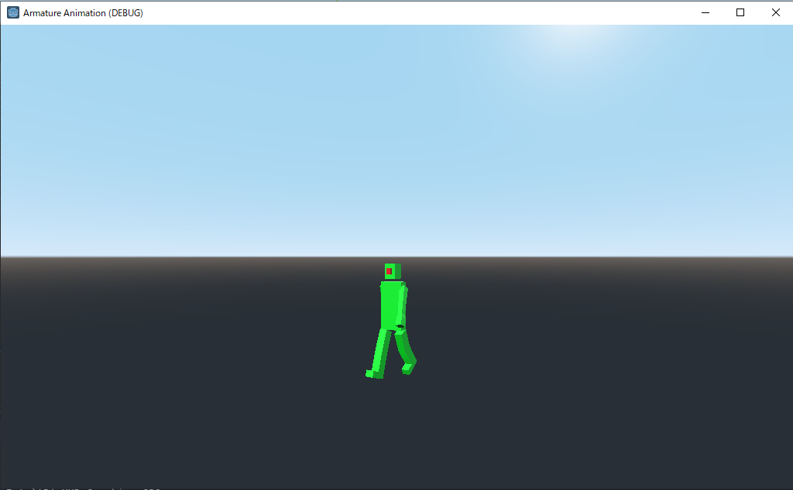

# Armature Animation

tried following in this project.

- import 3D model with armature animation from Blender

Steps

- In Blender
    - add mesh
    - add armature(bone)
    - apply mesh's Mirror modifier
        - keep Armature modifier
    - create animations in "Dope Sheet" window's "Action Editor"
        - create new action
            - check "Fake User" on
        - move time cursor to where to insert keyframe
        - in pose mode
            - select all bones and "insert keyframe"
    - create NLA tracks in "Nonlinear Animation" window
        - add track
        - "Push Down Action" button to put an action as a strip into NLA track
        - change track's name
            - "-loop" suffix make the animation loop in Godot
        - set track's checkbox on
    - export a data file into Godot's project directory
        - select mesh and armature
        - File > Export > glTF 2.0(.glb/.gltf)
            - Include
                - check "Limit to Selected Objects" on
            - Transform
                - check "+ Y Up" on
            - Geometry
                - check "Apply modifiers" off
            - Animation
                - check "Animation" on
                - check "Skining" on
- In Godot
    - import material and animation files
        - select gltf file in file system window
        - select import window
        - choose "import material and animation file separately" in preset combo box
        - click "re-import"
    - import scene
        - select gltf file in file system window
        - click mouse's right button and choose "new inherited scene"
    - confirmed that following export file type of this project works
        - html
        - android

versions

- Blender 2.92.0
- Godot 3.2.3.stable
