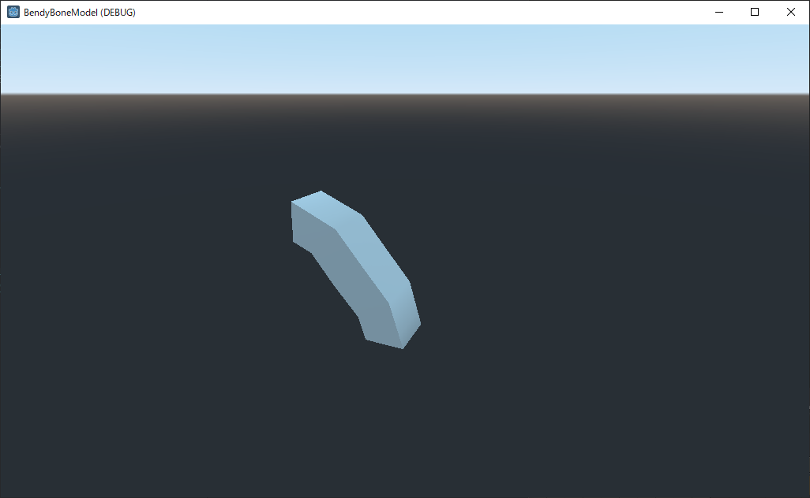
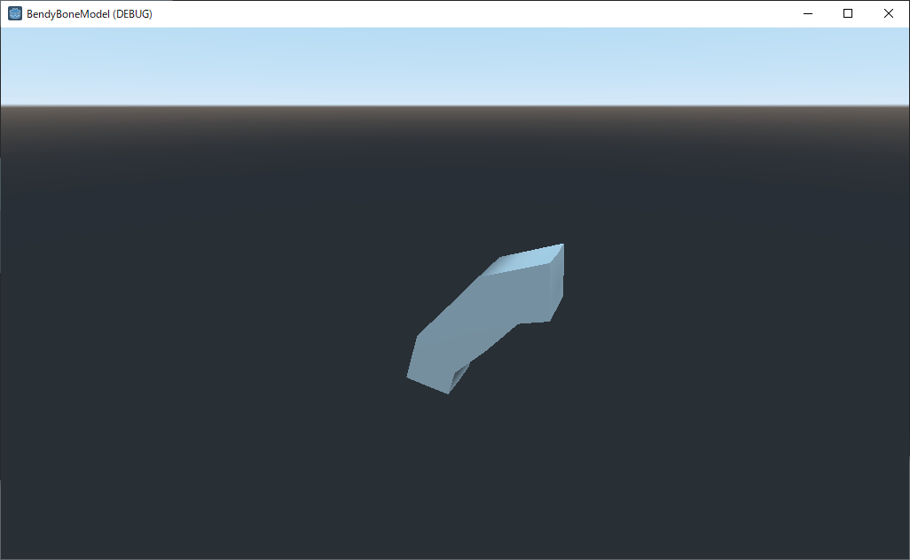

# BendyBoneModel

This is a simple sample of importing blender model that uses [bendy bones](https://docs.blender.org/manual/en/latest/animation/armatures/bones/properties/bendy_bones.html).

[bendy ボーン](https://docs.blender.org/manual/en/latest/animation/armatures/bones/properties/bendy_bones.html)を使用したBlenderのモデルをインポートする簡単なサンプルです。

- Godot 3.3.2.stable
- Blender 2.93.102.0

reference

- [2.8]Bendy Bones
    https://note.com/lab1092/n/n188c1059e844
