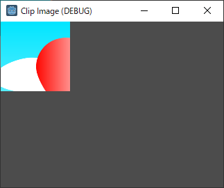

# Clip Image

a sample how to clip image.

tested Godot Engine v3.2.3

- Control node and its ancestors have a function to clip image displayed in its rect.
    - set 0 to all "Anchor" 's properties (Left, Top, Right, Bottom)  not to change the clipped image size when to change window size.
    - set "Clip Content" on
    - set 100, 100 to "Size". (it links to Margin.Right and Margin.Bottom, which would be changed to 100)
- TextureRect is a node to display an image file as texture.
    - set image file on "Texture"
        - The image file must be located in the project directory.
    - To change the width and height of the image, set "Expand" on, then change "Size"

Original image

Clipped image

(Japanese translation)

イメージのクリップの仕方のサンプル

Godot Engine v3.2.3 で確認しました。

- Control ノード と その祖先は、その内部に表示したイメージをクリップ(切り取って表示)する機能があります。
    - "Anchor"のLeft, Top, Right, Bottom に 0 をセットして、ウィンドウサイズの変更に合わせてイメージのサイズが変更されないようにします。
    - "Clip Content" を オンにします。
    - "Size"に 100, 100 をセットします。(Margin.Right と Margin.Bottom がこれに連動し、100 になります。)
- TextureRect は イメージファイルをテクスチャとして表示するノードです。
    - "Texture" にイメージファイルをセットします。
        - イメージファイルはプロジェクトのディレクトリに置いておく必要があります。
    - イメージの幅、高さを変えるには、"Expand"をオンにして、"Size" を変更します。
