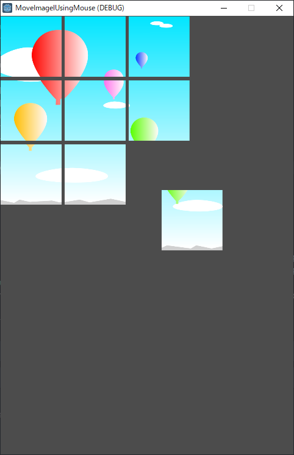

# Move Image Using Mouse

a sample to move images using mouse

tested Godot Engine v3.2.3

- Mouse Event like clicking button or moving the mouse cursor can child.get_rect().has_point(event.position)handle at _input.
    - https://docs.godotengine.org/en/stable/classes/class_node.html#class-node-method-input
    - there is another function, named _unhandled_input()
- to create node instances dynamically, for example Piece node,
    - ``` export (PackedScene) var Piece ```
    - ``` var p = Piece.instance() ```
- to check the mouse cursor on the node,
    - ``` child.get_rect().has_point(event.position) ```


