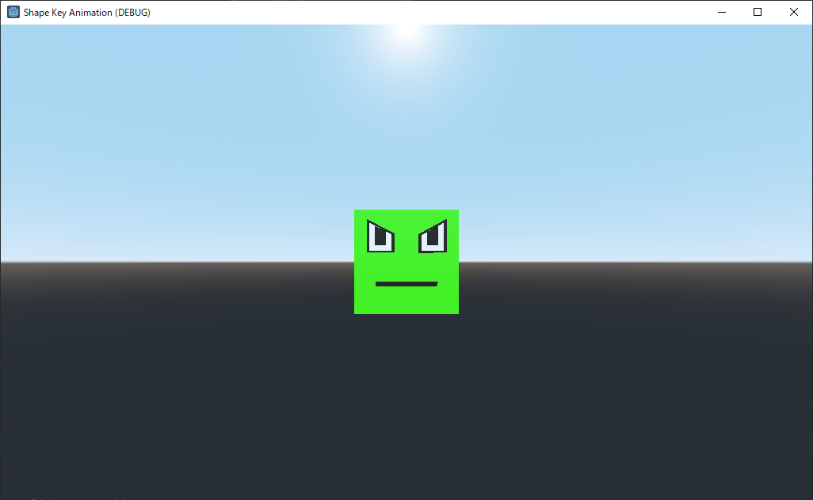

# Shape Key Animation

In this project, tried following things.

- exports a 3D model with shape key anmations to gltf file in Blender.
- imports gltf file into Godot
- plays animations in Godot

<video width="513" height="316" controls>
    <source src="./docs/capture.mp4" type="video/mp4">
</video>

## how to export and import a 3D model

- Blender
    - sample file: assets/20201212_shapekey_sample.blend
    - Export > glTF 2.0
        - Format > glTF Embedded(.gltf)
        - Remember Export Setting -> on
        - Transform > Y Up -> on
        - Geometry > Apply Modifiers -> should be off
        - export file (xxx.gltf) into Godot's project directory
- Godot
    - select 20201212_shapekey_sample.gltf
    - select "Import" tab
       - click reimport
    - open 20201212_shapekey_sample.gltf
        - choose "open anyway"
        - or choose "new Inherited" ("新規の継承" in Japanese)
    - save as scene

## versions

- Blender 2.92.0
- Godot 3.2.3.stable

## references

- Blender to Godot shape keys
  - https://www.youtube.com/watch?v=HTzo7ZxDDkk
