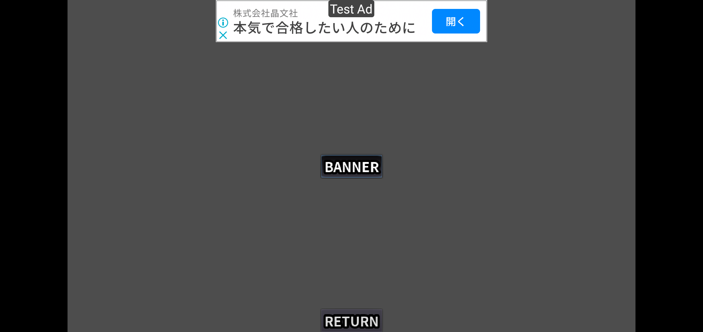
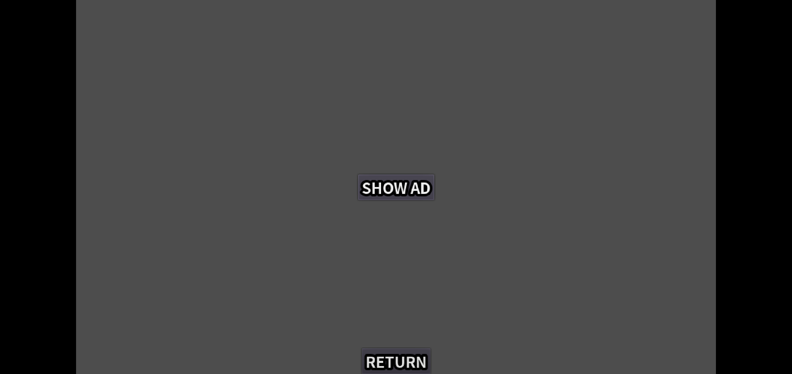
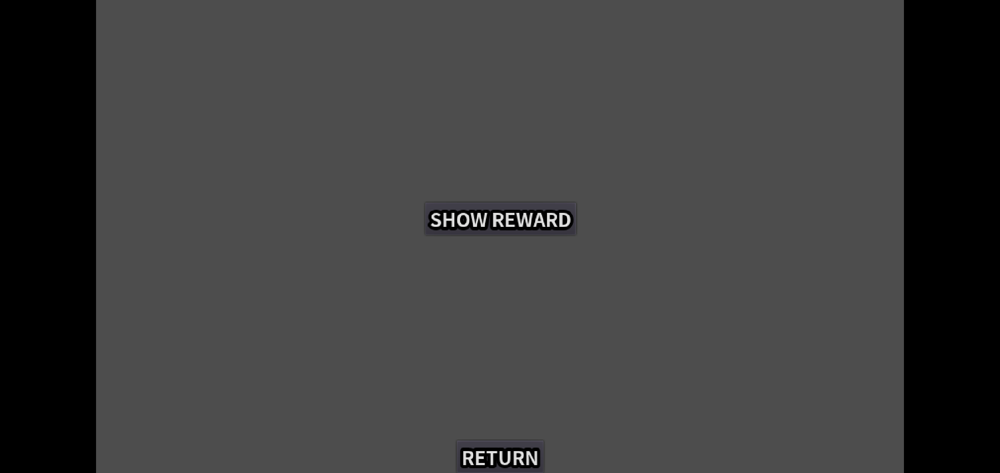

# Admob_sample

This is a sample of [Godot AdMob Android](https://github.com/Poing-Studios/godot-admob-android).

You can see folloging types of advertisement in this sample;

- banner
    
- interstitial
    
- reward
    

Running this app on Android Emulator and watching Logcat on Android Studio is good to see how the plugin works.

## Installation

Following plugins are needed to show advertisement of [Admob](https://admob.google.com/home/)

- [Godot AdMob Android](https://github.com/Poing-Studios/godot-admob-android)
    - This plugin is installed into an android package.
    - You need to ```Use Custom Build``` and enable ```AdMob``` plugin at the export configuration for Android.
- [Godot AdMob Editor Plugin](https://github.com/Poing-Studios/godot-admob-editor)
    - This plugin is installed into an godot project.
    - This plugin is used to ...
        - edit Admob configuration in the godot editor.
            - You can enable the plugin at ``` Project→Project Settings→Plugins```

        - call Admob API and handle signals sent by Admob in a godot project.
            - You need to configure ```MobileAds``` as a singleton
                - ```Project→Project Settings→AutoLoad```
                - Name: ```MobileAds```
                - Path: ```res://addons/admob/src/singletons/MobileAds.gd```

## Environment

- Godot 3.5.1
- godot-admob-android 2.1.2

## Reference

- [MobileAds API(methods and signals)](https://github.com/Poing-Studios/godot-admob-editor#api)

