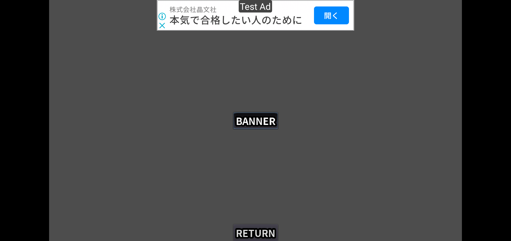
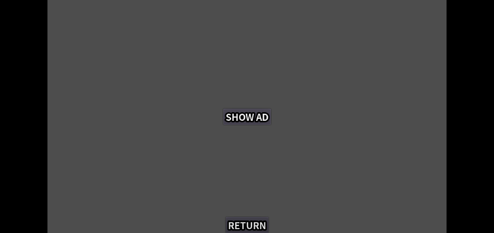
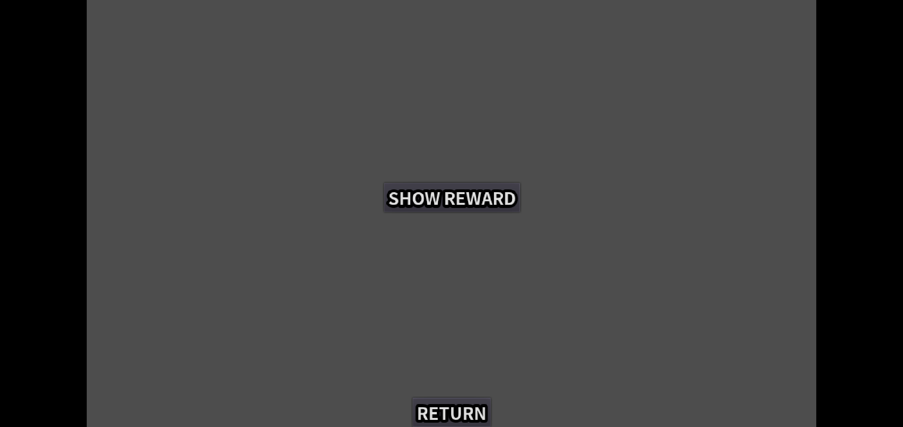

# Admob_sample

This is a sample of [Godot AdMob Android](https://github.com/Poing-Studios/godot-admob-android).

You can see folloging types of advertisement in this sample;

- banner
    
- interstitial
    
- reward
    

There is another way to show advertisement ```rewarded-interstitial ``` but it is not dealt with here.

Running this app on Android Emulator and watching Logcat on Android Studio is good to see how the plugin works.

## Installation

Following plugins are needed to show advertisement of [Admob](https://admob.google.com/home/)

- [Godot AdMob Android](https://github.com/Poing-Studios/godot-admob-android)
    - This plugin is installed into an android package.
    - You need to ```Use Custom Build``` and enable ```AdMob``` plugin at the export configuration for Android.
- [Godot AdMob Editor Plugin](https://github.com/Poing-Studios/godot-admob-editor)
    - This plugin is installed into an godot project.
    - This plugin is used to ...
        - edit Admob configuration in the godot editor.
            - You can enable the plugin at ``` Project→Project Settings→Plugins```

        - call Admob API and handle signals sent by Admob in a godot project.
            - You need to configure ```MobileAds``` as a singleton
                - ```Project→Project Settings→AutoLoad```
                - Name: ```MobileAds```
                - Path: ```res://addons/admob/src/singletons/MobileAds.gd```

## How to use the plugin

Basically, Calling ```MobileAds.load_XXX()``` will start displaying an advertisement view component. 

Signals emit when relating events happend.

- An ad content is loaded.
- An ad content is failed to load.
- An ad content is failed to show.
- An ad content is opened.
- An ad content is clicked.
- An ad content is closed.
- When recoding impression.
- and so on...

If a user watches an advertisement for at least several seconds,
signal ```user_earned_rewarded``` is emitted and a user can earn a reward which consists of an unit and an amount.

## Environment

- Godot 4.1.1
- godot-admob-android 2.1.4

## Reference

- [MobileAds API(methods and signals)](https://github.com/Poing-Studios/godot-admob-editor#api)
- [Mobile Ads SDK（Android）](https://developers.google.com/admob/android/quick-start)
- [MobileAds](https://firebase.google.com/docs/reference/android/com/google/android/gms/ads/MobileAds)