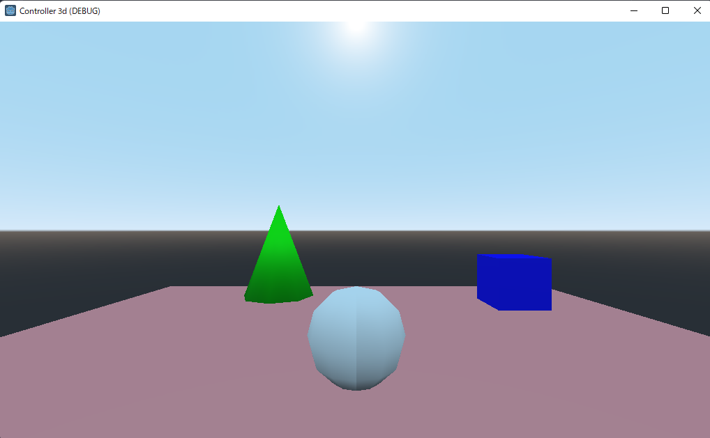
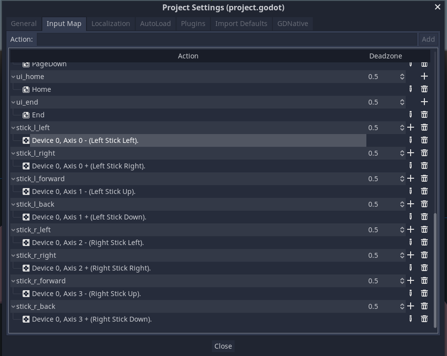

# controller_3d

## Purpose

- use joy pad's analog sticks to move and rotate player object.




## How to use analog sticks

- define actions in Input Map of Project setting.
- use ```Input.get_vector()``` to get input of a analog stick

### Input Map


### Input.get_vector()

```javascript
var vector_left = Input.get_vector("stick_l_left", "stick_l_right", "stick_l_forward", "stick_l_back")

var vector_right = Input.get_vector("stick_r_left", "stick_r_right", "stick_r_forward", "stick_r_back")
```

## References

- Which Input singleton method should I use?
    https://docs.godotengine.org/ja/stable/tutorials/inputs/controllers_gamepads_joysticks.html#which-input-singleton-method-should-i-use
