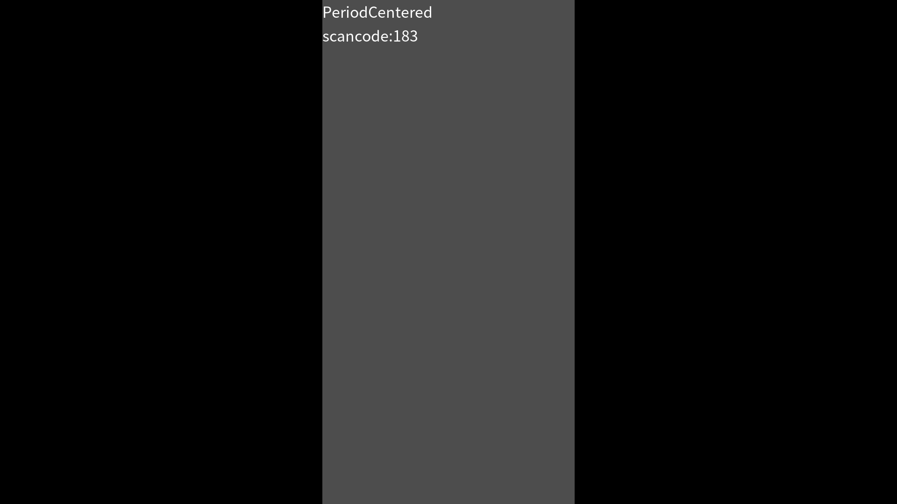
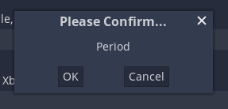
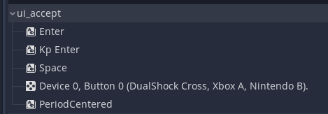

# Godot Input Scancode

I found that **Godot detects Android TV's D-PAD center button as "PeriodCentered" with scancode 183**.
This project is for checking this input key event process.  
Here is ```how to configure "PeriodCentered" key in Input Map of Project Settings.```

The environment I test is followings

- Godot: 3.4.3.stable
- Android Emulator: Android TV (1080p) API 29(Android 10)
- Windows 11

# How to check scancode

```
func _input(event):
    pass
    if event is InputEventKey:
        var result = ""
        result += event.as_text()
        result += "\n"
        result += "scancode:" + str(event.scancode)
        $Label.text = result
        print(result)
```

You can observe the key and its scancode on the display.



# Source codes

Here are some source codes that deal with keycodes, especially D-PAD center button on Android.

It seems that AKEYCODE_DPAD_CENTER is mapped to PERIODCENTERED.

https://github.com/godotengine/godot/blob/5d236138363627a29ef157e518390c2621078b5b/platform/android/android_keys_utils.h#L42-L60
```c++
static _WinTranslatePair _ak_to_keycode[] = {
	{ Key::TAB, AKEYCODE_TAB },
	{ Key::ENTER, AKEYCODE_ENTER },
	{ Key::SHIFT, AKEYCODE_SHIFT_LEFT },
	{ Key::SHIFT, AKEYCODE_SHIFT_RIGHT },
	{ Key::ALT, AKEYCODE_ALT_LEFT },
	{ Key::ALT, AKEYCODE_ALT_RIGHT },
	{ Key::MENU, AKEYCODE_MENU },
	{ Key::PAUSE, AKEYCODE_MEDIA_PLAY_PAUSE },
	{ Key::ESCAPE, AKEYCODE_BACK },
	{ Key::SPACE, AKEYCODE_SPACE },
	{ Key::PAGEUP, AKEYCODE_PAGE_UP },
	{ Key::PAGEDOWN, AKEYCODE_PAGE_DOWN },
	{ Key::HOME, AKEYCODE_HOME }, //(0x24)
	{ Key::LEFT, AKEYCODE_DPAD_LEFT },
	{ Key::UP, AKEYCODE_DPAD_UP },
	{ Key::RIGHT, AKEYCODE_DPAD_RIGHT },
	{ Key::DOWN, AKEYCODE_DPAD_DOWN },
	{ Key::PERIODCENTERED, AKEYCODE_DPAD_CENTER },
```

https://android.googlesource.com/platform/frameworks/native/+/refs/heads/android10-release/include/android/keycodes.h#112

```c++
/** Directional Pad Center key.
 * May also be synthesized from trackball motions. */
AKEYCODE_DPAD_CENTER     = 23,
```

# How to configure "PeriodCentered" key in Input Map of Project Settings

When adding a key into an action, for example "ui_accept", in Input Map of Project Settings of Godot, you must type the key that you want to add.   However typing "PeroidCentered" seems impossible on Windows.
Since this, Adding an alternative key, for example period ".", and changing scancode in "project.godot" file directly using text editor are needed as a work-around.

type an alternative key. typed period "." in this case.



before changing. scancode 46 is "Period".
```
Object(InputEventKey,"resource_local_to_scene":false,"resource_name":"","device":0,"alt":false,"shift":false,"control":false,"meta":false,"command":false,"pressed":false,"scancode":46,"physical_scancode":0,"unicode":0,"echo":false,"script":null)
```

after changing. scancode 183 is "PeriodCentered".
```
Object(InputEventKey,"resource_local_to_scene":false,"resource_name":"","device":0,"alt":false,"shift":false,"control":false,"meta":false,"command":false,"pressed":false,"scancode":183,"physical_scancode":0,"unicode":0,"echo":false,"script":null)
```

"PeroidCentered" appears after changing the scancode.


