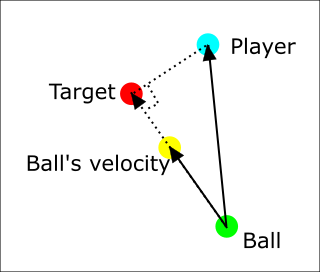
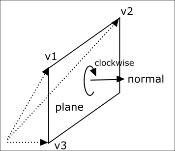

# Vector calculation

This sample is for understanding following things.

- how Vector3.project() works
- how Plane.project() works

# Version

- Godot 3.4 stable

# What to do in this sample

This sample calculates a vector that goes from ```Ball``` to ```Target```.

- Target is located on the line that ```Ball``` and ```Ball's velocity``` make.
- The angle which ```Player```, ```Target``` and Ball makes is 90 degrees.




# Calculations

## how Vector3.project() works

```
var ball = $Ball
var ball_velocity = $BallVelocity
var player = $Player
var target = $Target

var vec_velo_ball = ball_velocity.global_transform.origin - ball.global_transform.origin
var vec_player_ball = player.global_transform.origin - ball.global_transform.origin
var proj = vec_player_ball.project(vec_velo_ball)
var result_origin = ball.global_transform.origin + proj

target.global_transform.origin = result_origin
```

## how Plane.project() works

```
var ball = $Ball
var ball_velocity = $BallVelocity
var player = $Player
var target = $Target

# calc a plane on which ball and ball velocity are located
var plane_ball = Plane(ball.global_transform.origin,
    ball.global_transform.origin + Vector3.UP,
    ball_velocity.global_transform.origin)
var result_origin = plane_ball.project(player.global_transform.origin)

target.global_transform.origin = result_origin
```

When using Plane(v1, v2, v3), the next picture shows relation
v1, v2, v3 and the normal of the plane.




# Reference

- Plane(v1, v2, v3)
    - https://docs.godotengine.org/en/stable/classes/class_plane.html#class-plane-method-plane
- Vector3().project()
    - https://docs.godotengine.org/en/stable/classes/class_vector3.html#class-vector3-method-project
- Plane().project()
    - https://docs.godotengine.org/en/stable/classes/class_plane.html#class-plane-method-project
